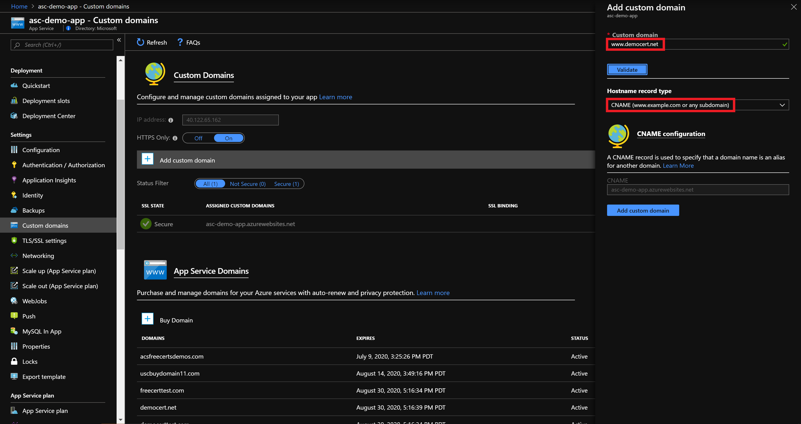
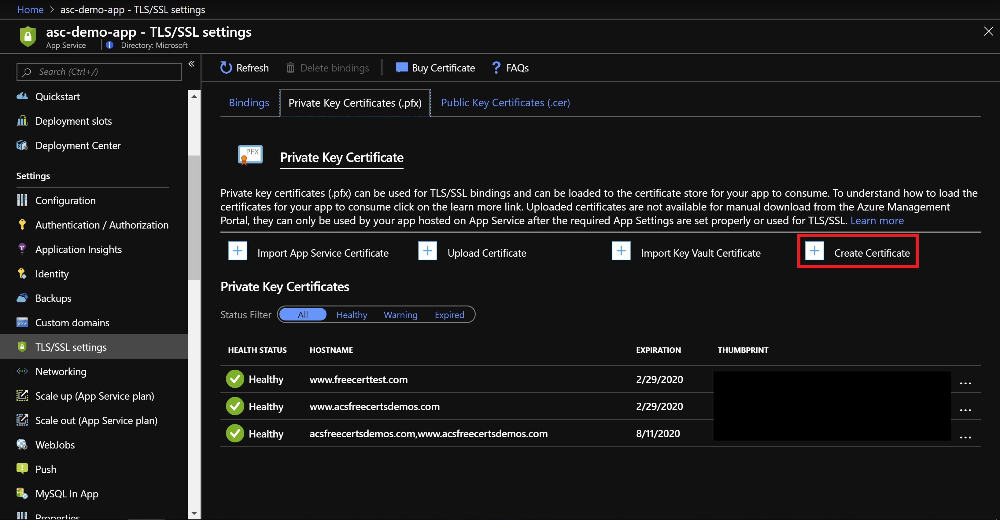
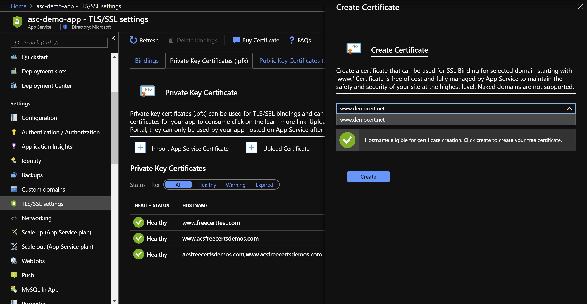
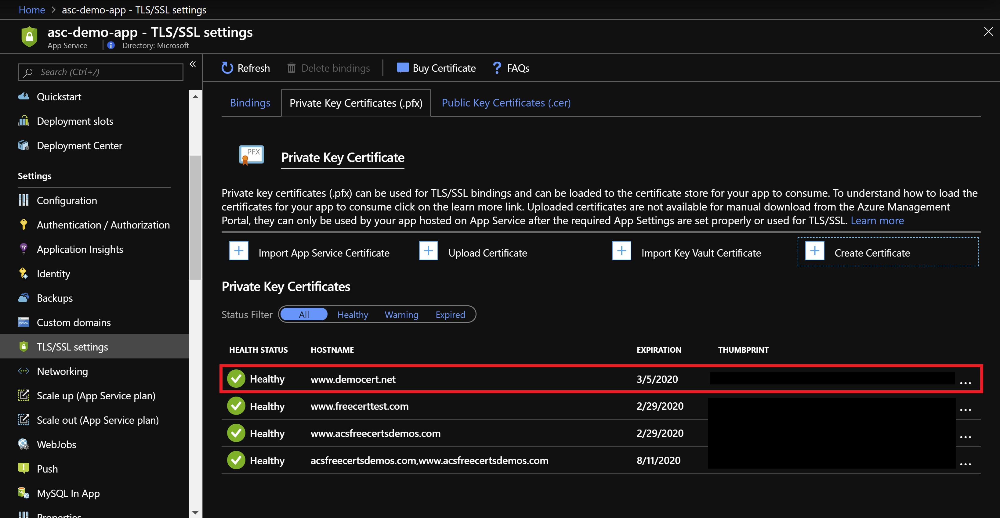

# App Service Managed Certificates
App Service Managed Certificates allow you to secure your web apps without having to buy an SSL certificate. For every custom www domain that has been configured as a CName record to your web app, you’ll be able to create a certificate for your domain at no cost. 
You will not be able to export App Service Managed Certificates and use them on other resources. This feature is not available for naked domains nor is it available for domains configured as A records.

## Configuring Domains
Custom domains added to your Web App must be a ‘www’ domain; naked domains are not supported in this feature. Also make sure that the record type is that of a CNAME as A Records are not supported in this feature either.

## Creating App Service Managed Certificates 
To create an App Service Managed Certificate, navigate to the Private Key Certificate section of your web app under the TLS/SSL settings on the blade. Once you’re on the page, click the “Create Certificate” button to begin.

A blade for Create Certificate will pop up from the right side of the window. In order to create an App Service Managed Certificate, select from dropdown menu the domain you want to create the certificate for and click “Create”. If you don’t see your domain on the list, make sure you have correctly configured your custom domain to the web app. This feature is only available for www domains with a CNAME record type.

Once your certificate has been issued, you’ll see it on the list of Private Key Certificates. The next steps would be to bind the certificate to your domain.

## Binding Certificates
Click [here](https://docs.microsoft.com/en-us/azure/app-service/web-sites-purchase-ssl-web-site#bind-certificate-to-app) for the instructions.

## Verifying HTTPS 

Visit your app using HTTPS://<domain_name> instead of HTTP://<domain_name> to verify that the certificate has been configured correctly. 